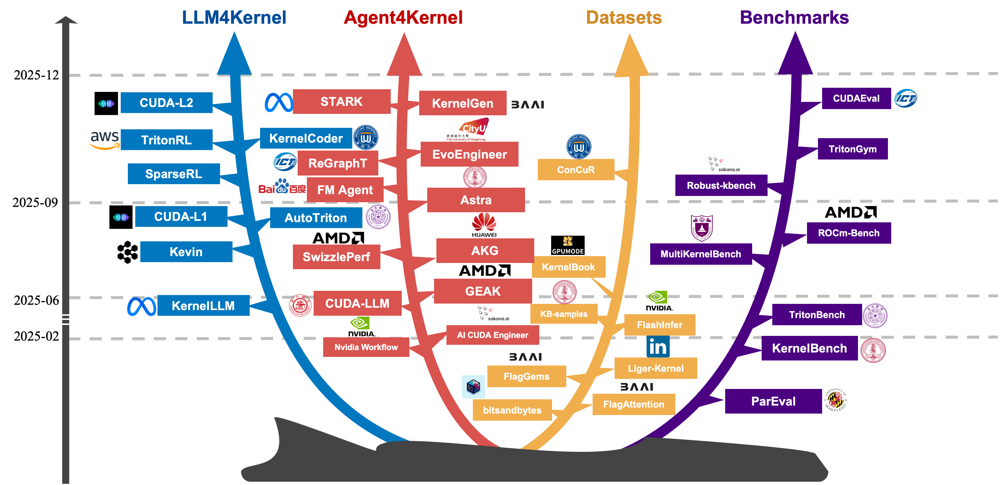
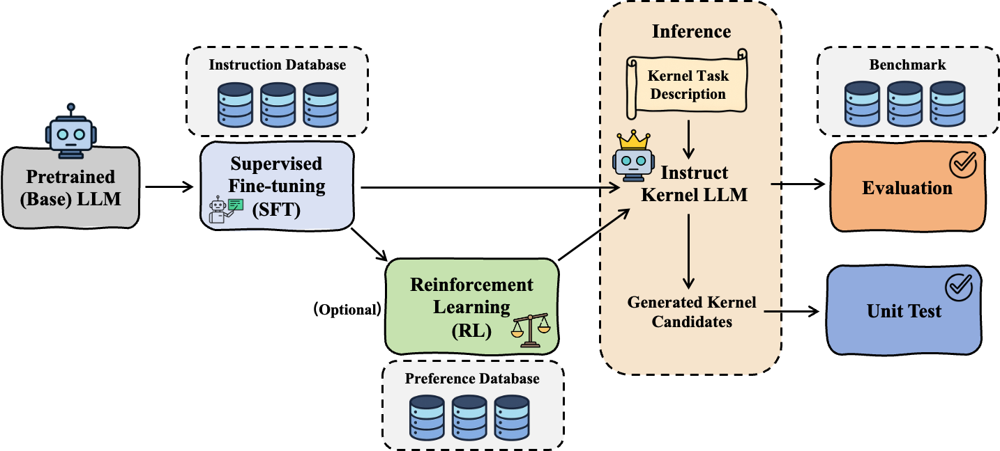
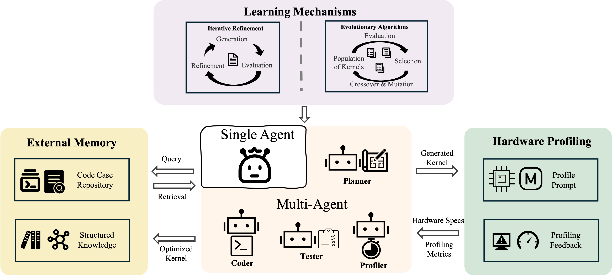

<center>


<h1 align="center"> :cherries:  Awesome LLM-Driven Kernel Generation  </h1>


<h2 align="center">🔥 <a href="./survey/AI4Kernel_survey.pdf">Survey</a> 🔥</h2>




</center>

This repo is created to introduce LLM-driven kernel generation and optimization. We categorized these researches into four main streams:

- LLM4Kernel
- LLMAgent4Kernel
- Datasets
- Benchmarks 

# 📌 Table of Content (ToC)

- [LLM4Kernel](#LLM4Kernel)
- [LLMAgent4Kernel](#LLMAgent4Kernel)
- [Datasets](#Datasets)
- [Benchmarks](#Benchmarks)


# LLM4Kernel

<center>



</center>

## SFT

\[10/2025] ConCuR: Conciseness Makes State-of-the-Art Kernel Generation [\[paper\]](https://arxiv.org/abs/2510.07356)

\[06/2025] KernelLLM: Making Kernel Development More Accessible [\[link\]](https://huggingface.co/facebook/KernelLLM)

## RL

\[09/2025] Mastering Sparse CUDA Generation through Pretrained Models and Deep Reinforcement Learning [\[paper\]](https://openreview.net/forum?id=VdLEaGPYWT)

\[07/2025] Kevin: Multi-Turn RL for Generating CUDA Kernels [\[paper\]](https://arxiv.org/abs/2507.11948)

\[07/2025] AutoTriton: Automatic Triton Programming with Reinforcement Learning in LLMs [\[paper\]](https://arxiv.org/abs/2507.05687)

\[10/2025] TritonRL: Training LLMs to Think and Code Triton Without Cheating [\[paper\]](https://arxiv.org/abs/2510.17891)

\[07/2025] CUDA-L1: Improving CUDA Optimization via Contrastive Reinforcement Learning [\[paper\]](https://arxiv.org/abs/2507.14111) | [\[code\]](https://github.com/deepreinforce-ai/CUDA-L1)

\[12/2025] CUDA-L2: Surpassing cuBLAS Performance for Matrix Multiplication through Reinforcement Learning [\[paper\]](https://arxiv.org/abs/2512.02551)

# LLMAgent4Kernel

<center>



</center>

## **Learning Mechanisms**

\[02/2025] Automating GPU Kernel Generation with Deepseek-r1 and Inference Time Scaling [\[blog\]](https://developer.nvidia.com/blog/automating-gpu-kernel-generation-with-deepseek-r1-and-inference-time-scaling/)&#x20;

\[10/2025] KernelGen [\[link\]](https://kernelgen.flagos.io/login)

\[09/2025] Towards Robust Agentic CUDA Kernel Benchmarking, Verification, and Optimization [\[paper\]](https://arxiv.org/abs/2509.14279) | [\[code\]](https://github.com/SakanaAI/robust-kbench)&#x20;

\[10/2025]The FM Agent [\[paper\]](https://arxiv.org/abs/2510.26144)  &#x20;

\[10/2025] EvoEngineer: Mastering Automated CUDA Kernel Code Evolution with Large Language Models [\[paper\]](https://arxiv.org/abs/2510.03760)&#x20;

\[06/2025] GPU Kernel Scientist: An LLM-Driven Framework for Iterative Kernel Optimization [\[paper\]](https://arxiv.org/html/2506.20807v2)&#x20;

## **External Memory Management**

\[02/2025] The AI CUDA Engineer: Agentic CUDA Kernel Discovery, Optimization and Composition [\[link\]](https://medium.com/@nimritakoul01/the-ai-cuda-engineer-99616536cd50)   &#x20;

\[10/2025] From Large to Small: Transferring CUDA Optimization Expertise via Reasoning Graph [\[paper\] ](https://arxiv.org/pdf/2510.19873)&#x20;

\[12/2025] KernelEvolve: Scaling Agentic Kernel Coding for Heterogeneous AI Accelerators at Meta [\[paper\]](https://arxiv.org/abs/2512.23236) 

## **Hardware-Awareness through Profiling**

\[06/2025] CUDA-LLM: LLMs Can Write Efficient CUDA Kernels [\[paper\] ](https://arxiv.org/abs/2506.09092) &#x20;

\[11/2025] PRAGMA: A Profiling-Reasoned Multi-Agent Framework for Automatic Kernel Optimization [\[paper\]](https://arxiv.org/abs/2511.06345)

\[08/2025] SwizzlePerf: Hardware-Aware LLMs for GPU Kernel Performance Optimization. [\[paper\]](https://arxiv.org/abs/2508.20258)

\[10/2025] Integrating Performance Tools in Model Reasoning for GPU Kernel Optimization [\[paper\] ](https://arxiv.org/abs/2510.17158)&#x20;

## **Multi-Agent Orchestration**

\[10/2025] STARK: Strategic Team of Agents for Refining Kernels [\[paper\]](https://arxiv.org/pdf/2510.16996)&#x20;

\[06/2025] AKG: Ai-powered automatic kernel generator [\[paper\]](https://arxiv.org/abs/2512.23424) | [\[code\] ](https://github.com/mindspore-ai/akg/tree/master/aikg) 

\[10/2025] CudaForge: An Agent Framework with Hardware Feedback for CUDA Kernel Optimization [\[paper\] ](https://arxiv.org/abs/2511.01884)| [\[code\]](https://github.com/OptimAI-Lab/CudaForge)

\[09/2025] Astra: A Multi-Agent System for GPU Kernel Performance Optimization [\[paper\]](https://arxiv.org/abs/2509.07506)

\[07/2025] Geak: Introducing Triton Kernel AI Agent & Evaluation Benchmarks [\[blog\]](https://rocm.blogs.amd.com/software-tools-optimization/triton-kernel-ai/README.html) | \[[paper\] ](https://arxiv.org/pdf/2507.23194)| [\[code\]](https://github.com/AMD-AGI/GEAK-agent) 


# Datasets
The dates listed in the table correspond to the initial release of each github repository. It is important to note that these libraries are under active development, with continuous updates and optimizations following their inception.

## Structured Datasets (Hugging Face & Benchmarks)

\[02/2024] **The Stack v2** (HPC Subset) [\[paper\]](https://arxiv.org/abs/2402.19173) | [\[dataset\]](https://huggingface.co/datasets/bigcode/the-stack-v2)

\[06/2024] **HPC-Instruct**: A Dataset for HPC Code Optimization [\[paper\]](https://arxiv.org/abs/2406.11921) | [\[dataset\]](https://huggingface.co/datasets/hpcgroup/hpc-instruct)

\[05/2025] **KernelBook**: Torch-Triton Aligned Corpus [\[dataset\]](https://huggingface.co/datasets/GPUMODE/KernelBook) | [\[repo\]](https://github.com/gpu-mode/triton-index)

\[02/2025] **KernelBench Samples**: Optimization Tasks & Performance Traces [\[dataset\]](https://huggingface.co/datasets/ScalingIntelligence/kernelbench-samples)

## Code-Centric Corpora (GitHub Repositories)

### **High-Performance Primitives**

\[12/2017] **CUTLASS**: CUDA C++ Template Library [\[code\]](https://github.com/NVIDIA/cutlass)

\[05/2022] **FlashAttention**: Fast and Memory-Efficient Exact Attention [\[paper\]](https://arxiv.org/abs/2205.14135) | [\[code\]](https://github.com/Dao-AILab/flash-attention)

\[11/2023] **FlagAttention** — Memory Efficient Attention Operators Implemented in Triton [\[code\]](https://github.com/flagos-ai/FlagAttention)

\[02/2024] **AoTriton** — AOT-compiled Triton Kernels for AMD ROCm [\[code\]](https://github.com/ROCm/aotriton)  

\[11/2021] **xFormers** — Hackable and Optimized Transformer Building Blocks [\[code\]](https://github.com/facebookresearch/xformers)  

\[08/2024] **Liger-Kernel** — Efficient Training Kernels for LLMs [\[code\]](https://github.com/linkedin/Liger-Kernel)

\[04/2024] **FlagGems** — Triton-based Operator Library  [\[code\]](https://github.com/FlagOpen/FlagGems)  

\[09/2022] **Bitsandbytes** — 8-bit Quantization Wrappers for LLMs [\[code\]](https://github.com/bitsandbytes-foundation/bitsandbytes)  

\[09/2024] **Gemlite** — Triton Kernels for Efficient Low-Bit Matrix Multiplication [\[code\]](https://github.com/dropbox/gemlite)

\[01/2025] **FlashInfer**: Kernel Library for LLM Serving [\[code\]](https://github.com/flashinfer-ai/flashinfer)

\[05/2021] **FBGEMM** — Low-precision High-performance Matrix Multiplication [\[code\]](https://github.com/pytorch/FBGEMM)  

\[09/2022] **Transformer Engine** — FP8 Acceleration Library for Transformer Models [\[code\]](https://github.com/NVIDIA/TransformerEngine)  

### **System-Level Frameworks (Parallel Corpora)**

\[10/2016] **PyTorch (ATen)** — Foundational Tensor Library for C++ and Python [[code\]](https://github.com/pytorch/pytorch)  

\[06/2023] **vLLM**: Easy, Fast, and Cheap LLM Serving [\[paper\]](https://arxiv.org/abs/2309.06180) | [\[code\]](https://github.com/vllm-project/vllm)

\[12/2023] **SGLang** — Structured Generation Language for LLMs [\[code\]](https://github.com/sgl-project/sglang)

\[03/2023] **llama.cpp** — C/C++ Inference Port of LLaMA Models [\[code\]](https://github.com/ggerganov/llama.cpp)  

\[08/2023] **TensorRT-LLM**: TensorRT for LLM Inference [\[code\]](https://github.com/NVIDIA/TensorRT-LLM)

\[10/2019] **DeepSpeed**: System for Large Scale Model Training [\[paper\]](https://arxiv.org/abs/1910.02054) | [\[code\]](https://github.com/deepspeedai/DeepSpeed)

### **Emerging DSLs & Tools**

\[07/2019] **Triton**: Open-Source GPU Programming Language [\[paper\]](https://dl.acm.org/doi/10.1145/3315508.3329973) | [\[code\]](https://github.com/triton-lang/triton)

\[03/2024] **ThunderKittens**: Tile primitives for CUDA [\[paper\]](https://hazyresearch.stanford.edu/blog/2024-05-12-tk) | [\[code\]](https://github.com/HazyResearch/ThunderKittens)

\[04/2024] **TileLang**: Intermediate Language for Tile-based Optimization [\[code\]](https://github.com/tile-ai/tilelang)

\[06/2024] **tt-metal**: Bare Metal Programming on Tenstorrent [\[code\]](https://github.com/tenstorrent/tt-metal)

\[12/2025] cuTile — NVIDIA DSL for Tile-centric Programming [\[docs\]](https://docs.nvidia.com/cuda/cutile-python/)

## Knowledge Bases & Educational Resources

### **Documentation & Guides**

\[06/2007] **CUDA C++ Programming Guide** (Initial Release v1.0) [\[docs\]](https://docs.nvidia.com/cuda/cuda-c-programming-guide/)

\[06/2007] **PTX ISA Reference** (Initial Release v1.0) [\[docs\]](https://docs.nvidia.com/cuda/parallel-thread-execution/)

\[05/2020] **NVIDIA Tuning Guides** (Ampere Architecture Launch) [\[docs\]](https://docs.nvidia.com/cuda/ampere-tuning-guide/index.html)

### **Community Indices & Tutorials**

\[01/2024] **GPU-MODE Resource Stream** [\[list\]](https://github.com/gpu-mode/resource-stream)

\[01/2024] **Triton Index** [\[list\]](https://github.com/gpu-mode/triton-index)

\[06/2016] **Awesome-CUDA** [\[list\]](https://github.com/Erkaman/Awesome-CUDA)

\[12/2023] **Awesome-GPU-Engineering** [\[list\]](https://github.com/goabiaryan/awesome-gpu-engineering)

\[05/2023] **LeetCUDA**: CUDA Programming Exercises [\[code\]](https://github.com/xlite-dev/LeetCUDA)

\[01/2023] **Triton-Puzzles**: Puzzles for learning Triton [\[code\]](https://github.com/srush/Triton-Puzzles)

\[01/2011] **Colfax Researc**h — technical hub dedicated to High-Performance Computing (HPC) and AI [\[link\]](https://research.colfax-intl.com/)

\[09/2018] **Nsight Compute** — GPU Kernel Profiling Guide [\[docs\]](https://docs.nvidia.com/nsight-compute/)


# Benchmarks

\[01/2024] Can Large Language Models Write Parallel Code? [\[paper\]](https://arxiv.org/abs/2401.12554) | [\[code\]](https://github.com/parallelcodefoundry/ParEval)

\[02/2025] KernelBench: Can LLMs Write Efficient GPU Kernels? [\[blog\]](https://scalingintelligence.stanford.edu/blogs/kernelbench/)｜[\[paper\]](https://arxiv.org/abs/2502.10517)｜[\[code\]](https://github.com/ScalingIntelligence/KernelBench)

\[02/2025] TRITONBENCH: Benchmarking Large Language Model Capabilities for Generating Triton Operators [\[paper\]](https://arxiv.org/pdf/2502.14752)｜[\[code\]](https://github.com/thunlp/TritonBench)

\[07/2025] MultiKernelBench: A Multi-Platform Benchmark for Kernel Generation [\[paper\]](https://www.arxiv.org/pdf/2507.17773)｜[\[code\]](https://github.com/wzzll123/MultiKernelBench)

\[07/2025] Geak: Introducing Triton Kernel AI Agent & Evaluation Benchmarks [\[blog\]](https://rocm.blogs.amd.com/software-tools-optimization/triton-kernel-ai/README.html) | [\[paper\] ](https://arxiv.org/pdf/2507.23194)| [\[code\]](https://github.com/AMD-AGI/GEAK-agent)&#x20;

\[09/2025] Towards Robust Agentic CUDA Kernel Benchmarking, Verification, and Optimization [\[paper\]](https://arxiv.org/abs/2509.14279) | [\[code\]](https://github.com/SakanaAI/robust-kbench)&#x20;

\[10/2025] TritonGym: A Benchmark for Agentic LLM Workflows in Triton GPU Code Generation [\[paper\]](https://openreview.net/forum?id=oaKd1fVgWc)

\[10/2025] From Large to Small: Transferring CUDA Optimization Expertise via Reasoning Graph [\[paper\]](https://arxiv.org/abs/2510.19873)

***

# Contributing
Given the rapid pace of research in LLM-driven kernel generation, we may have inadvertently overlooked some key papers. Contributions to this repository are highly encouraged! Please feel free to submit a pull request or open an issue to share additions or feedback.


# Citation

If you find this project useful, please cite:

```bibtex
@misc{baai2026AI4kernel,
      title={Towards Automated Kernel Generation in the Era of LLMs: A Surveye, 
      author={Yang Yu, Peiyu Zang, Chi Hsu Tsai, Haiming Wu, Yixin Shen, Jialing Zhang, Haoyu Wang, Jingze Shi, Yuyu Luo, Wentao Zhang, Chunlei Men and Guang Liu},
      year={2026},
      howpublished={arXiv preprint},
      url={[https://github.com/flagos-ai/awesome-LLM-driven-kernel-generation](https://github.com/flagos-ai/awesome-LLM-driven-kernel-generation.git)}
}

