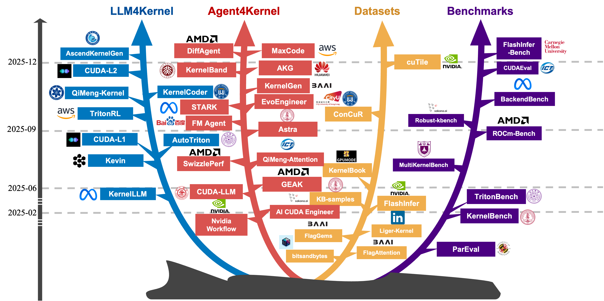
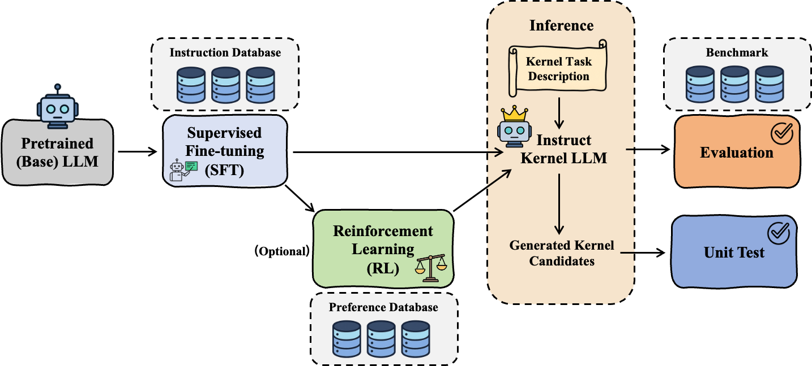
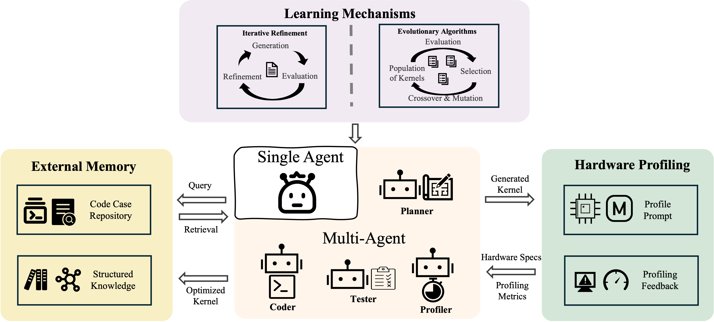

<center>


<h1 align="center"> :cherries:  Awesome LLM-Driven Kernel Generation  </h1>

<h2 align="center">🔥 <a href="https://arxiv.org/abs/2601.15727">Paper</a> 🔥</h2>



</center>

The integration of Large Language Models (LLMs) and agentic systems marks a pivotal shift in high-performance computing, transforming kernel engineering from a labor-intensive, expert-dependent process into a scalable, automated workflow. To provide a systematic perspective on this rapidly evolving field, we summarize the related literature below. Note that the works are organized according to the taxonomy proposed in the survey. We categorized these researches into four main streams:


# 📌 Table of Content (ToC)

- [LLM4Kernel](#LLM4Kernel)
- [Agent4Kernel](#Agent4Kernel)
- [Evaluation](#Evaluation)
- [Datasets](#Datasets)
- [Benchmarks](#Benchmarks)


# LLM4Kernel

<center>



</center>

Applying LLMs to kernel synthesis presents universal challenges in correctness and performance-sensitive structuring across diverse programming abstractions. Addressing these complexities, this section reviews the two principal post-training methodologies that dominate current research: supervised fine-tuning and reinforcement learning. 

## SFT

\[06/2025] KernelLLM: Making Kernel Development More Accessible [\[link\]](https://huggingface.co/facebook/KernelLLM)

\[10/2025] ConCuR: Conciseness Makes State-of-the-Art Kernel Generation [\[paper\]](https://arxiv.org/abs/2510.07356)

\[03/2026] InCoder-32B: Code Foundation Model for Industrial Scenarios [\[paper\]](https://arxiv.org/pdf/2603.16790) | [\[code\]](https://github.com/CSJianYang/Industrial-Coder) 

\[04/2026] InCoder-32B-Thinking: Industrial Code World Model for Thinking [\[paper\]](https://arxiv.org/pdf/2604.03144) | [\[code\]](https://github.com/CSJianYang/Industrial-Coder)

## RL

\[07/2025] AutoTriton: Automatic Triton Programming with Reinforcement Learning in LLMs [\[paper\]](https://arxiv.org/abs/2507.05687)

\[07/2025] CUDA-L1: Improving CUDA Optimization via Contrastive Reinforcement Learning [\[paper\]](https://arxiv.org/abs/2507.14111) | [\[code\]](https://github.com/deepreinforce-ai/CUDA-L1)

\[07/2025] Kevin: Multi-Turn RL for Generating CUDA Kernels [\[paper\]](https://arxiv.org/abs/2507.11948)

\[09/2025] Mastering Sparse CUDA Generation through Pretrained Models and Deep Reinforcement Learning [\[paper\]](https://openreview.net/forum?id=VdLEaGPYWT)

\[10/2025] TritonRL: Training LLMs to Think and Code Triton Without Cheating [\[paper\]](https://arxiv.org/abs/2510.17891)

\[11/2025] QiMeng-Kernel: Macro-Thinking Micro-Coding Paradigm for LLM-Based High-Performance GPU Kernel Generation [\[paper\]](https://arxiv.org/abs/2511.20100)

\[12/2025] CUDA-L2: Surpassing cuBLAS Performance for Matrix Multiplication through Reinforcement Learning [\[paper\]](https://arxiv.org/abs/2512.02551)

\[01/2026] AscendKernelGen: A Systematic Study of LLM-Based Kernel Generation for Neural Processing Units [\[paper\]](https://arxiv.org/abs/2601.07160)

\[02/2026] Dr. Kernel: Reinforcement Learning Done Right for Triton Kernel Generations [\[paper\]](https://arxiv.org/pdf/2602.05885) | [\[code\]](https://github.com/hkust-nlp/KernelGYM) 

\[02/2026] Improving HPC Code Generation Capability of LLMs via Online Reinforcement Learning with Real-Machine Benchmark Rewards [\[paper\]](https://arxiv.org/pdf/2602.12049)

\[02/2026] CUDA Agent: Large-Scale Agentic RL for High-Performance CUDA Kernel Generation [\[paper\]](https://arxiv.org/pdf/2602.24286) | [\[code\]](https://github.com/BytedTsinghua-SIA/CUDA-Agent)
 
\[03/2026] Kernel-Smith: A Unified Recipe for Evolutionary Kernel Optimization [\[paper\]](https://arxiv.org/abs/2603.28342)

# Agent4Kernel

<center>



</center>

While foundational LLMs are often limited to static, one-pass inference, agentic systems introduce an autonomous, closed-loop paradigm characterized by iterative planning, tool use, and feedback-driven refinement. This shift enables scalable, long-horizon optimization beyond the reach of manual or single-pass methods. To systematically evaluate this landscape, we categorize agent-driven advancements into four structural dimensions: learning mechanisms, external memory management, hardware profiling integration, and multi-agent orchestration.

## **Learning Mechanisms**

\[02/2025] Automating GPU Kernel Generation with Deepseek-r1 and Inference Time Scaling [\[blog\]](https://developer.nvidia.com/blog/automating-gpu-kernel-generation-with-deepseek-r1-and-inference-time-scaling/)

\[06/2025] GPU Kernel Scientist: An LLM-Driven Framework for Iterative Kernel Optimization [\[paper\]](https://arxiv.org/html/2506.20807v2)

\[09/2025] Towards Robust Agentic CUDA Kernel Benchmarking, Verification, and Optimization [\[paper\]](https://arxiv.org/abs/2509.14279) | [\[code\]](https://github.com/SakanaAI/robust-kbench)

\[10/2025] The FM Agent [\[paper\]](https://arxiv.org/abs/2510.26144)

\[10/2025] EvoEngineer: Mastering Automated CUDA Kernel Code Evolution with Large Language Models [\[paper\]](https://arxiv.org/abs/2510.03760)

\[10/2025] KernelGen [\[link\]](https://kernelgen.flagos.io/login)\[12/2025] 

\[11/2025] AUTOCOMP: A POWERFUL AND PORTABLE CODE OPTIMIZER FOR TENSOR ACCELERATORS [\[paper\]](https://arxiv.org/pdf/2505.18574)

\[11/2025] AccelOpt: A Self-Improving LLM Agentic System for AI Accelerator Kernel Optimization [\[paper\]](https://arxiv.org/pdf/2511.15915) | [\[code\]](https://github.com/zhang677/AccelOpt)

\[12/2025] PEAK: A Performance Engineering AI-Assistant for GPU Kernels Powered by Natural Language Transformations [\[paper\]](https://arxiv.org/abs/2512.19018)

\[12/2025] cuPilot: A Strategy-Coordinated Multi-agent Framework for CUDA Kernel Evolution [\[paper\]](https://arxiv.org/pdf/2512.16465)

\[12/2025] GPU Kernel Optimization Beyond Full Builds: An LLM Framework with Minimal Executable Programs [\[paper\]](https://arxiv.org/abs/2512.22147)

\[12/2025] Agentic Operator Generation for ML ASICs [\[paper\]](https://arxiv.org/pdf/2512.10977)

\[01/2026] DiffBench Meets DiffAgent: End-to-End LLM-Driven Diffusion Acceleration Code Generation [\[paper\]](https://arxiv.org/abs/2601.03178)

\[01/2026] MaxCode: A Max-Reward Reinforcement Learning Framework for Automated Code Optimization [\[paper\]](https://arxiv.org/abs/2601.05475)

\[01/2026] AscendCraft: Automatic Ascend NPU Kernel Generation via DSL-Guided Transcompilation [\[paper\]](https://arxiv.org/pdf/2601.22760)

\[02/2026] K-Search: LLM Kernel Generation via Co-Evolving Intrinsic World Model [\[paper\]](https://arxiv.org/pdf/2602.19128) | [\[code\]](https://github.com/caoshiyi/K-Search) 

\[03/2026] AutoKernel: Autonomous GPU Kernel Optimization via Iterative Agent-Driven Search [\[paper\]](https://arxiv.org/pdf/2603.21331) | [\[code\]](https://github.com/RightNow-AI/autokernel)

\[03/2026] KERNELFOUNDRY: HARDWARE-AWARE EVOLUTIONARY GPU KERNEL OPTIMIZATION [\[paper\]](https://arxiv.org/pdf/2603.12440)

\[03/2026] AVO: Agentic Variation Operators for Autonomous Evolutionary Search [\[paper\]](https://arxiv.org/pdf/2603.24517)

\[03/2026] AKO: Agentic Kernel Optimization (a harness for existing coding agents) [\[project\]](https://tongminglaic.github.io/AKO/) | [\[code\]](https://github.com/TongmingLAIC/AKO4ALL)

\[04/2026] CuTeGen: An LLM-Based Agentic Framework for Generation and Optimization of High-Performance GPU Kernels using CuTe [\[paper\]](https://arxiv.org/abs/2604.01489)

\[04/2026] AdaExplore: Failure-Driven Adaptation and DiversityPreserving Search for Efficient Kernel Generation [\[paper\]](https://arxiv.org/pdf/2604.16625) | [\[code\]](https://github.com/StigLidu/AdaExplore)

\[04/2026] FACT: Compositional Kernel Synthesis with a Three-Stage Agentic Workflow [\[paper\]](https://arxiv.org/pdf/2604.26666)

\[05/2026] CuBridge: An LLM-Based Framework for Understanding and Reconstructing High-Performance Attention Kernels [\[paper\]](https://arxiv.org/pdf/2605.05023)  


## **External Memory / Experience / Skill Management**

\[02/2025] The AI CUDA Engineer: Agentic CUDA Kernel Discovery, Optimization and Composition [\[link\]](https://medium.com/@nimritakoul01/the-ai-cuda-engineer-99616536cd50)

\[10/2025] From Large to Small: Transferring CUDA Optimization Expertise via Reasoning Graph [\[paper\] ](https://arxiv.org/pdf/2510.19873)

\[12/2025] KernelEvolve: Scaling Agentic Kernel Coding for Heterogeneous AI Accelerators at Meta [\[paper\]](https://arxiv.org/abs/2512.23236) 

\[02/2026] KERNELBLASTER: CONTINUAL CROSS-TASK CUDA OPTIMIZATION VIA MEMORY-AUGMENTED IN-CONTEXT REINFORCEMENT [\[paper\]](https://arxiv.org/pdf/2602.14293)

\[03/2026] Towards Cold-Start Drafting and Continual Refining: A Value-Driven Memory Approach with Application to NPU Kernel Synthesis [\[paper\]](https://arxiv.org/abs/2603.10846) | [\[project\]](https://evokernel.zhuo.li/)

\[03/2026] KernelSkill: A Multi-Agent Framework for GPU Kernel Optimization [\[paper\]](https://arxiv.org/html/2603.10085v1) | [\[code\]](https://github.com/0satan0/KernelMem/)

\[04/2026] ARGUS: Agentic GPU Optimization Guided by Data-Flow Invariants [\[paper\]](https://arxiv.org/pdf/2604.18616)


## **Hardware Profiling Integration**

\[03/2025] **IntelliKit**: LLM-ready profiling and analysis toolkit for AMD GPUs [\[code\]](https://github.com/AMDResearch/intellikit)

\[04/2025] QiMeng-GEMM: Automatically Generating High-Performance Matrix Multiplication Code by Exploiting Large Language Models [\[paper\]](https://ojs.aaai.org/index.php/AAAI/article/view/34461)

\[05/2025] QiMeng-TensorOp: Automatically Generating High-Performance Tensor Operators with Hardware Primitives [\[paper\]](https://arxiv.org/abs/2505.06302)

\[06/2025] CUDA-LLM: LLMs Can Write Efficient CUDA Kernels [\[paper\] ](https://arxiv.org/abs/2506.09092)

\[06/2025] IntelliPerf: Profiling-guided LLM framework for iterative GPU kernel optimization on AMD GPUs [\[blog\]](https://github.com/AMDResearch/intelliperf/blob/main/docs/IntelliPerf.md) | [\[code\]](https://github.com/AMDResearch/intelliperf)

\[07/2025] QiMeng-Attention: SOTA Attention Operator is generated by SOTA Attention Algorithm [\[paper\]](https://aclanthology.org/2025.findings-acl.446/)

\[08/2025] SwizzlePerf: Hardware-Aware LLMs for GPU Kernel Performance Optimization [\[paper\]](https://arxiv.org/abs/2508.20258)

\[10/2025] Integrating Performance Tools in Model Reasoning for GPU Kernel Optimization [\[paper\] ](https://arxiv.org/abs/2510.17158)

\[11/2025] KernelBand: Boosting LLM-based Kernel Optimization with a Hierarchical and Hardware-aware Multi-armed Bandit [\[paper\]](https://arxiv.org/abs/2511.18868)

\[11/2025] PRAGMA: A Profiling-Reasoned Multi-Agent Framework for Automatic Kernel Optimization [\[paper\]](https://arxiv.org/abs/2511.06345)

\[12/2025] TritonForge: Profiling-Guided Framework for Automated Triton Kernel Optimization [\[paper\] ](https://arxiv.org/abs/2512.09196)

\[04/2026] cuda-kernel-optimizer [\[code\]](https://github.com/KernelFlow-ops/cuda-optimized-skill)

\[05/2026] KEET: Explaining Performance of GPU Kernels Using LLM Agents [\[paper\]](https://arxiv.org/pdf/2605.04467) 


## **Multi-Agent Orchestration**

\[06/2025] AKG: Ai-powered automatic kernel generator [\[paper\]](https://arxiv.org/abs/2512.23424) | [\[code\] ](https://github.com/mindspore-ai/akg/tree/master/akg_agents) 

\[07/2025] Geak: Introducing Triton Kernel AI Agent & Evaluation Benchmarks [\[blog\]](https://rocm.blogs.amd.com/software-tools-optimization/triton-kernel-ai/README.html) | \[[paper\] ](https://arxiv.org/pdf/2507.23194)| [\[code\]](https://github.com/AMD-AGI/GEAK-agent) 

\[09/2025] Astra: A Multi-Agent System for GPU Kernel Performance Optimization [\[paper\]](https://arxiv.org/abs/2509.07506)

\[10/2025] STARK: Strategic Team of Agents for Refining Kernels [\[paper\]](https://arxiv.org/pdf/2510.16996)

\[10/2025] CudaForge: An Agent Framework with Hardware Feedback for CUDA Kernel Optimization [\[paper\] ](https://arxiv.org/abs/2511.01884)| [\[code\]](https://github.com/OptimAI-Lab/CudaForge)

\[11/2025] KForge: Program Synthesis for Diverse AI Hardware Accelerators [\[paper\]](https://arxiv.org/abs/2511.13274)

\[11/2025] KernelFalcon: Autonomous GPU Kernel Generation via Deep Agents [\[blog\]](https://pytorch.org/blog/kernelfalcon-autonomous-gpu-kernel-generation-via-deep-agents/)

\[01/2026] A Two-Stage GPU Kernel Tuner Combining Semantic Refactoring and Search-Based Optimization [\[paper\]](https://arxiv.org/pdf/2601.12698)

\[04/2026] Optimas: An Intelligent Analytics-Informed Generative AI Framework for Performance Optimization [\[paper\]](https://arxiv.org/pdf/2604.23892) 

# Evaluation
Evaluating how LLMs optimize high-performance kernels is a complex task that requires a multi-faceted approach in both analysis and design. This section surveys the landscape of evaluation methodologies, providing a structured guidance for researchers and practitioners in the field for robust AI-driven system design.

\[05/2026] Towards Feedback-to-Plan Decisions for Self-Evolving LLM Agents in CUDA Kernel Generation [\[paper\]](https://arxiv.org/abs/2605.26720) | [\[code\]](https://github.com/yuxuan-z19/cudanalyst)

# Datasets
High-quality data in this domain is defined not merely by volume, but by its ability to bridge the semantic gap between high-level algorithms and low-level hardware optimizations. In this section, we survey the data landscape and organize resources. The dates listed in the table correspond to the initial release of each github repository. It is important to note that these libraries are under active development, with continuous updates and optimizations following their inception.

## Structured Datasets 

\[02/2024] **The Stack v2** (HPC Subset) [\[paper\]](https://arxiv.org/abs/2402.19173) | [\[dataset\]](https://huggingface.co/datasets/bigcode/the-stack-v2)

\[06/2024] **HPC-Instruct** A Dataset for HPC Code Optimization [\[paper\]](https://arxiv.org/abs/2406.11921) | [\[dataset\]](https://huggingface.co/datasets/hpcgroup/hpc-instruct)

\[05/2025] **KernelBook** Torch-Triton Aligned Corpus [\[dataset\]](https://huggingface.co/datasets/GPUMODE/KernelBook) | [\[repo\]](https://github.com/gpu-mode/triton-index)

\[02/2025] **KernelBench Samples** Optimization Tasks & Performance Traces [\[dataset\]](https://huggingface.co/datasets/ScalingIntelligence/kernelbench-samples)

## Source Code Repositories

### **Operator and Kernel Libraries**

\[12/2017] **CUTLASS** — CUDA C++ Template Library [\[code\]](https://github.com/NVIDIA/cutlass)

\[05/2022] **FlashAttention** — Fast and Memory-Efficient Exact Attention [\[paper\]](https://arxiv.org/abs/2205.14135) | [\[code\]](https://github.com/Dao-AILab/flash-attention)

\[11/2023] **FlagAttention** — Memory Efficient Attention Operators Implemented in Triton [\[code\]](https://github.com/flagos-ai/FlagAttention)

\[02/2024] **AoTriton** — AOT-compiled Triton Kernels for AMD ROCm [\[code\]](https://github.com/ROCm/aotriton)  

\[11/2021] **xFormers** — Hackable and Optimized Transformer Building Blocks [\[code\]](https://github.com/facebookresearch/xformers)  

\[08/2024] **Liger-Kernel** — Efficient Training Kernels for LLMs [\[code\]](https://github.com/linkedin/Liger-Kernel)

\[04/2024] **FlagGems** — Triton-based Operator Library  [\[code\]](https://github.com/FlagOpen/FlagGems)  

\[09/2022] **Bitsandbytes** — 8-bit Quantization Wrappers for LLMs [\[code\]](https://github.com/bitsandbytes-foundation/bitsandbytes)  

\[09/2024] **Gemlite** — Triton Kernels for Efficient Low-Bit Matrix Multiplication [\[code\]](https://github.com/dropbox/gemlite)

\[11/2024] **AITER** — AMD operator and kernel library for high-performance AI workloads [\[code\]](https://github.com/ROCm/aiter)

\[01/2025] **FlashInfer** — Kernel Library for LLM Serving [\[code\]](https://github.com/flashinfer-ai/flashinfer)

\[05/2021] **FBGEMM** — Low-precision High-performance Matrix Multiplication [\[code\]](https://github.com/pytorch/FBGEMM)  

\[09/2022] **Transformer Engine** — FP8 Acceleration Library for Transformer Models [\[code\]](https://github.com/NVIDIA/TransformerEngine)  

\[09/2025] **DeepGEMM** — clean and efficient FP8 GEMM kernels with fine-grained scaling [\[code\]](https://github.com/deepseek-ai/DeepGEMM)

\[01/2026] **HPC-ops** — High Performance LLM Inference Operator Library [\[code\]](https://github.com/Tencent/hpc-ops)

\[04/2026] **Tile Kernels** — A kernel library written in tilelang [\[code\]](https://github.com/deepseek-ai/TileKernels)

### **Frameworks and System Integration Code**

\[10/2016] **PyTorch (ATen)** — Foundational Tensor Library for C++ and Python [[code\]](https://github.com/pytorch/pytorch)  

\[06/2023] **vLLM** — Easy, Fast, and Cheap LLM Serving [\[paper\]](https://arxiv.org/abs/2309.06180) | [\[code\]](https://github.com/vllm-project/vllm)

\[12/2023] **SGLang** — Structured Generation Language for LLMs [\[code\]](https://github.com/sgl-project/sglang)

\[03/2023] **llama.cpp** — C/C++ Inference Port of LLaMA Models [\[code\]](https://github.com/ggerganov/llama.cpp)  

\[03/2025] **IntelliKit** — LLM-ready profiling and analysis toolkit for AMD GPUs [\[code\]](https://github.com/AMDResearch/intellikit)

\[08/2023] **TensorRT-LLM** — TensorRT for LLM Inference [\[code\]](https://github.com/NVIDIA/TensorRT-LLM)

\[10/2019] **DeepSpeed** — System for Large Scale Model Training [\[paper\]](https://arxiv.org/abs/1910.02054) | [\[code\]](https://github.com/deepspeedai/DeepSpeed)

### **Domain-Specific Languages and Emerging Abstractions**

\[07/2019] **Triton** — Open-Source GPU Programming Language [\[paper\]](https://dl.acm.org/doi/10.1145/3315508.3329973) | [\[code\]](https://github.com/triton-lang/triton)

\[03/2024] **ThunderKittens** — Tile primitives for CUDA [\[paper\]](https://hazyresearch.stanford.edu/blog/2024-05-12-tk) | [\[code\]](https://github.com/HazyResearch/ThunderKittens)

\[04/2024] **TileLang** — Intermediate Language for Tile-based Optimization [\[code\]](https://github.com/tile-ai/tilelang)

\[06/2024] **tt-metal** — Bare Metal Programming on Tenstorrent [\[code\]](https://github.com/tenstorrent/tt-metal)

\[12/2025] **cuTile** — NVIDIA DSL for Tile-centric Programming [\[docs\]](https://docs.nvidia.com/cuda/cutile-python/)

## Knowledge Bases

### **Documentation & Guides**

\[06/2007] **CUDA C++ Programming Guide** (Initial Release v1.0) [\[docs\]](https://docs.nvidia.com/cuda/cuda-c-programming-guide/)

\[06/2007] **PTX ISA Reference** (Initial Release v1.0) [\[docs\]](https://docs.nvidia.com/cuda/parallel-thread-execution/)

\[05/2020] **NVIDIA Tuning Guides** (Ampere Architecture Launch) [\[docs\]](https://docs.nvidia.com/cuda/ampere-tuning-guide/index.html)

### **Community Indices & Tutorials**

\[01/2024] **GPU-MODE Resource Stream** [\[list\]](https://github.com/gpu-mode/resource-stream)

\[01/2024] **Triton Index** [\[list\]](https://github.com/gpu-mode/triton-index)

\[06/2016] **Awesome-CUDA** [\[list\]](https://github.com/Erkaman/Awesome-CUDA)

\[12/2023] **Awesome-GPU-Engineering** [\[list\]](https://github.com/goabiaryan/awesome-gpu-engineering)

\[05/2023] **LeetCUDA** CUDA Programming Exercises [\[code\]](https://github.com/xlite-dev/LeetCUDA)

\[01/2023] **Triton-Puzzles** Puzzles for learning Triton [\[code\]](https://github.com/srush/Triton-Puzzles)

\[01/2011] **Colfax Research** — technical hub dedicated to High-Performance Computing (HPC) and AI [\[link\]](https://research.colfax-intl.com/)

\[09/2018] **Nsight Compute** — GPU Kernel Profiling Guide [\[docs\]](https://docs.nvidia.com/nsight-compute/)

\[07/2024] **CUDA Course** [\[docs\]](https://github.com/Infatoshi/cuda-course)

\[actively maintained] **HGPU** - High performance computing on graphics processing units [\[link\]](https://hgpu.org/)


# Benchmarks
This section surveys the landscape of kernel generation benchmarking, providing a structured analysis of key evaluation frameworks.

\[01/2024] Can Large Language Models Write Parallel Code? [\[paper\]](https://arxiv.org/abs/2401.12554) | [\[code\]](https://github.com/parallelcodefoundry/ParEval)

\[02/2025] KernelBench: Can LLMs Write Efficient GPU Kernels? [\[blog\]](https://scalingintelligence.stanford.edu/blogs/kernelbench/)｜[\[paper\]](https://arxiv.org/abs/2502.10517)｜[\[code\]](https://github.com/ScalingIntelligence/KernelBench)

\[02/2025] TRITONBENCH: Benchmarking Large Language Model Capabilities for Generating Triton Operators [\[paper\]](https://arxiv.org/pdf/2502.14752)｜[\[code\]](https://github.com/thunlp/TritonBench)

\[07/2025] MultiKernelBench: A Multi-Platform Benchmark for Kernel Generation [\[paper\]](https://www.arxiv.org/pdf/2507.17773)｜[\[code\]](https://github.com/wzzll123/MultiKernelBench)

\[07/2025] Geak: Introducing Triton Kernel AI Agent & Evaluation Benchmarks [\[blog\]](https://rocm.blogs.amd.com/software-tools-optimization/triton-kernel-ai/README.html) | [\[paper\] ](https://arxiv.org/pdf/2507.23194)| [\[code\]](https://github.com/AMD-AGI/GEAK-agent)

\[09/2025] Towards Robust Agentic CUDA Kernel Benchmarking, Verification, and Optimization [\[paper\]](https://arxiv.org/abs/2509.14279) | [\[code\]](https://github.com/SakanaAI/robust-kbench)

\[09/2025] BackendBench [\[code\]](https://github.com/meta-pytorch/BackendBench)

\[10/2025] TritonGym: A Benchmark for Agentic LLM Workflows in Triton GPU Code Generation [\[paper\]](https://openreview.net/forum?id=oaKd1fVgWc)

\[10/2025] From Large to Small: Transferring CUDA Optimization Expertise via Reasoning Graph [\[paper\]](https://arxiv.org/abs/2510.19873)

\[01/2026] FlashInfer-Bench: Building the Virtuous Cycle for AI-driven LLM Systems [\[paper\]](https://arxiv.org/abs/2601.00227) | [\[blog\]](https://flashinfer.ai/2025/10/21/flashinfer-bench.html) | [\[Competition\]](https://mlsys26.flashinfer.ai/)

\[02/2026] ISO-Bench: Can Coding Agents Optimize Real-World Inference Workloads? [\[paper\]](https://arxiv.org/pdf/2602.19594) | [\[code\]](https://github.com/Lossfunk/ISO-Bench) | [\[project\]](https://ayushnangia.github.io/iso-bench-website/)

\[03/2026] ComputeEval [\[code\]](https://github.com/NVIDIA/compute-eval)

\[03/2026] KernelArena [\[code\]](https://github.com/wafer-ai/kernel-arena) | [\[project\]](https://www.kernelarena.ai/)

\[03/2026] KernelCraft: Benchmarking for Agentic Close-to-Metal Kernel Generation on Emerging Hardware [\[paper\]](https://arxiv.org/abs/2603.08721)

\[03/2026] SOL-ExecBench: Speed-of-Light Benchmarking for Real-World GPU Kernels Against Hardware Limits [\[paper\]](https://arxiv.org/abs/2603.19173) | [\[project\]](https://research.nvidia.com/benchmarks/sol-execbench)

\[03/2026] CelloAI Benchmarks: Toward Repeatable Evaluation of AI Assistants? [\[paper\]](https://arxiv.org/pdf/2603.01051)

\[03/2026] Making LLMs Optimize Multi-Scenario CUDA Kernels Like Experts [\[paper\]](https://arxiv.org/abs/2603.07169)

\[03/2026] KernelBench-v3 [\[code\]](https://github.com/Infatoshi/KernelBench-v3)

\[03/2026] Standard Kernel Rubric: Evaluating Kernel Generation Systems [\[blog\]](https://standardkernel.com/blog/standard-kernel-rubric/)

\[04/2026] CANN Bench [\[code\]](https://gitcode.com/cann/cann-bench)

\[05/2026] KernelBenchX: A Comprehensive Benchmark for Evaluating LLM-Generated GPU Kernels [\[paper\]](https://arxiv.org/pdf/2605.04956) | [\[code\]](https://github.com/BonnieW05/KernelBenchX)


***

# Contributing
Given the rapid pace of research in LLM-driven kernel generation, we may have inadvertently overlooked some key papers. Contributions to this repository are highly encouraged! Please feel free to submit a pull request or open an issue to share additions or feedback.


# Citation

An early  long preprint of this work was released on TechRxiv, which reflects an initial and exploratory stage of the survey. The current arXiv manuscript is a substantially improved and condensed revision, incorporating many additional recent works and a more focused and carefully refined presentation. If you find this work useful, please feel free to cite it as:

```bibtex
@misc{yu2026automatedkernelgenerationera,
      title={Towards Automated Kernel Generation in the Era of LLMs}, 
      author={Yang Yu and Peiyu Zang and Chi Hsu Tsai and Haiming Wu and Yixin Shen and Jialing Zhang and Haoyu Wang and Zhiyou Xiao and Jingze Shi and Yuyu Luo and Wentao Zhang and Chunlei Men and Guang Liu and Yonghua Lin},
      year={2026},
      eprint={2601.15727},
      archivePrefix={arXiv},
      primaryClass={cs.LG},
      url={https://arxiv.org/abs/2601.15727}, 
}
